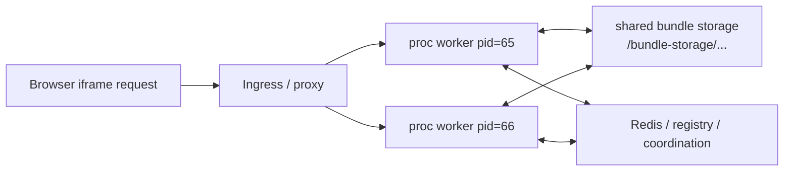
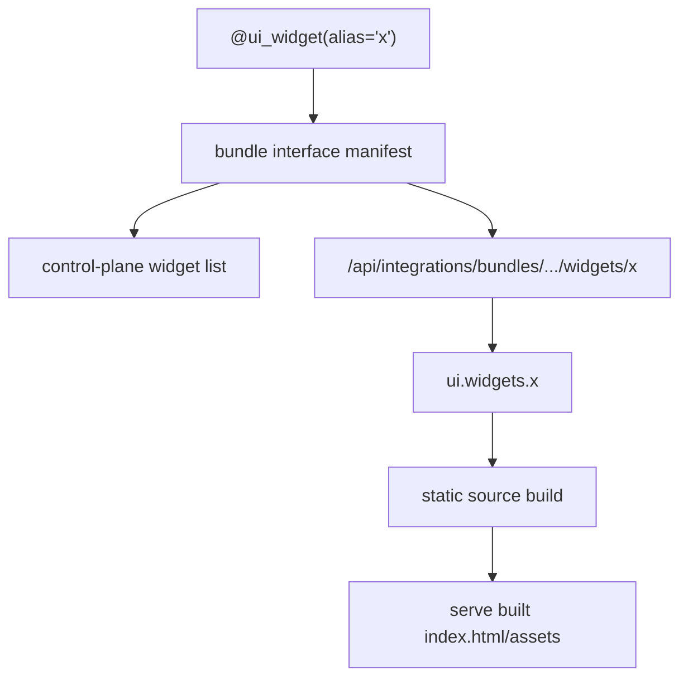
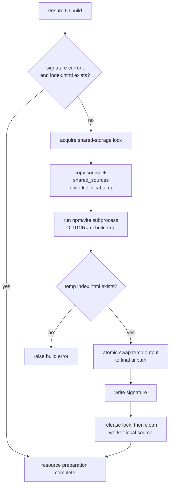
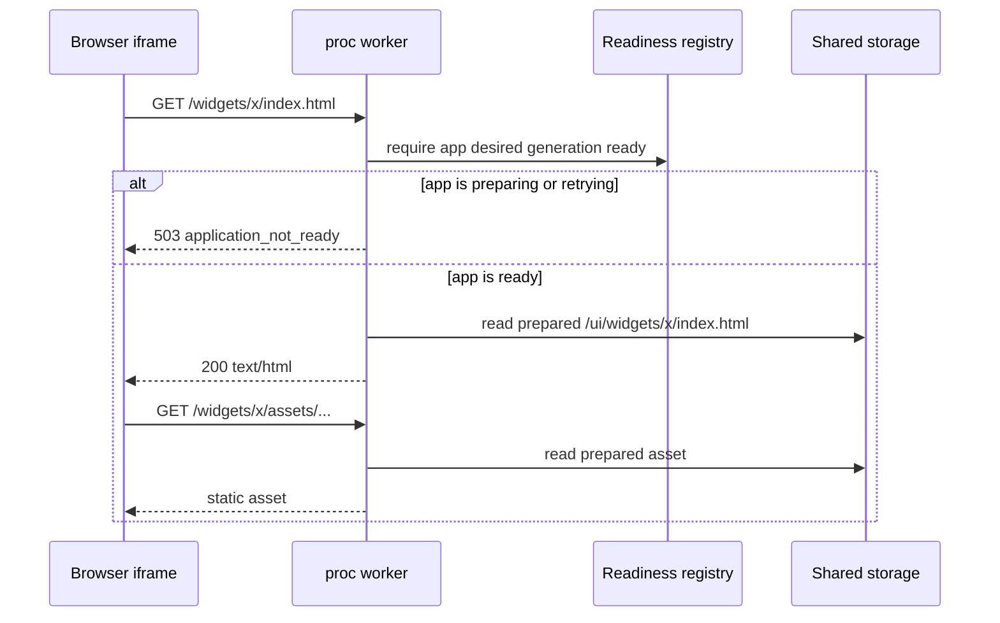
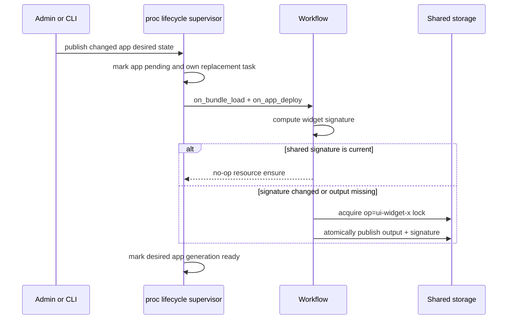
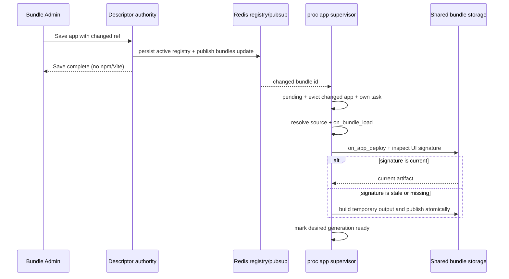
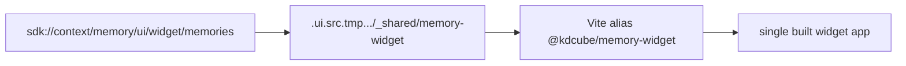

# UI Components Lifecycle

Use this doc when you need to understand why a bundle UI surface appears in the
control plane, when its source folder is built, where the built files are
stored, and what happens under concurrent proc workers.

This page covers source-folder UI components:

- bundle main view configured by `ui.main_view`
- bundle widgets configured by `ui.widgets.<alias>`
- shared SDK UI sources copied by `shared_sources`

For deciding whether an app should ship KDCube-served UI at all, or instead be
consumed by a direct host browser/server client as a backend-only app, start
with [How To Integrate With KDCube Apps](../../how-to-integrate-with-kdcube-apps-README.md).

It does not describe chat message rendering, ReAct artifacts, or generated
runtime widgets inside model output.

## Runtime Context

Bundle UI builds run inside the chat **proc** service, not inside ISO runtime.
The proc worker that performs the build uses normal Python code plus `npm` /
`vite` subprocesses.

Execution contexts:

| Context | What it does |
| --- | --- |
| Proc worker lifespan | Loads the registry, creates the application lifecycle supervisor, and schedules every desired app generation. |
| Owned app preparation task | Materializes one app, runs process-local `on_bundle_load`, enters the shared resource barrier, and publishes readiness. |
| Proc request handler | Checks app readiness and serves already prepared widget/main-view files. |
| Build subprocess | Runs `npm install`, `npm ci`, `vite build`, or the configured command. |
| Local temporary storage | Stores the copied build source and transient `node_modules` for the worker performing the build. |
| Shared storage | Stores built UI files, temporary output, signatures, and cross-worker locks. |
| ISO runtime | Not involved in UI component builds. |

In ECS, Docker Compose, or any multi-worker deployment, each Uvicorn worker is a
separate Python process. Workers share bundle storage through the configured
storage root, but they do not share Python module caches, process-local app
readiness/tasks, or process-local request state.



The route may reach any worker inside the proc task. Every worker runs its own
process-local app initialization. Shared UI publication remains guarded by
storage signatures and locks so workers converge on one artifact generation.

## Surface Discovery Versus Build Config

A widget needs a declared surface. A static build config is not enough.



The contracts are:

- `@ui_widget(alias="x")` declares that widget `x` exists.
- `ui.widgets.x` says widget `x` should be served as a built static app.
- `enabled.widget.x` enables or disables the widget surface.
- `ui.widgets.x.enabled` enables or disables the static-app config for
  that surface.

If `@ui_widget(alias="x")` exists and `ui.widgets.x` does not exist,
the route invokes the decorated Python method.

If `ui.widgets.x` exists and `@ui_widget(alias="x")` does not exist,
the config does not create a widget. The widget route has no surface to resolve
and should fail as an undefined widget.

If both exist, static serving wins for that alias. The decorated method remains
the authoritative manifest surface; the browser receives the built files from
`<bundle_storage_root>/ui/widgets/x` when `ui.widgets.x.src_folder` and
`build_command` are active.

Inherited widgets follow the same rule. A child entrypoint that inherits
`@ui_widget(alias="x")` from a parent has already declared widget `x`. It can:

- suppress the surface with `enabled.widget.x: false`
- replace the served UI with `ui.widgets.x.src_folder/build_command`
- override the same Python method name if it must change decorator metadata

It must not add a different decorated method with the same alias. Duplicate
aliases are rejected during manifest discovery.

Do not confuse these flags:

| Config | Meaning |
| --- | --- |
| `enabled.widget.x: false` | disables the widget surface; route/listing treats it as unavailable |
| `ui.widgets.x.enabled: false` | disables only the static source-folder app for `x`; an existing decorated method may still be served |

Main views are separate:

- `ui.main_view` configures the bundle main view build.
- `ui.widgets.<alias>` configures widget builds.
- A main view is not a widget and does not make a widget toolbar icon appear.

## Config Sources

The effective UI config is built from bundle defaults plus descriptor props.

Bundle code usually owns stable build wiring:

```python
def configuration_defaults(self):
    return {
        "ui": {
            "widgets": {
                "telegram_miniapp": {
                    "enabled": False,
                    "src_folder": "ui/widgets/telegram_miniapp",
                    "build_command": "npm install --no-package-lock && OUTDIR=<VI_BUILD_DEST_ABSOLUTE_PATH> npm run build",
                    "shared_sources": {
                        "memory_widget": {
                            "src_folder": "sdk://context/memory/ui/widget/memories",
                            "target": "_shared/memory-widget",
                        },
                    },
                },
            },
        },
    }
```

Deployment descriptors usually own environment policy:

```yaml
config:
  enabled:
    widget:
      memories: false
  ui:
    widgets:
      telegram_miniapp:
        enabled: true
```

For built-in/reference bundles, prefer putting `src_folder`, `build_command`,
and required `shared_sources` in `configuration_defaults()`. This avoids
forcing every deployment descriptor to repeat internal source wiring.

## Build Inputs And Outputs

For a widget alias `x`, the builder uses:

| Item | Location |
| --- | --- |
| Source folder | `<bundle_root>/<src_folder>` or a resolved `bundle://` / `sdk://` path |
| Temporary source | `${BUNDLE_UI_BUILD_WORK_ROOT:-<system-temp>/kdcube-ui-build}/<operation>.<pid>.<uuid>` |
| Temporary output | `<bundle_storage_root>/.ui.build.tmp.<pid>.<uuid>` |
| Final widget output | `<bundle_storage_root>/ui/widgets/x` |
| Widget signature | `<bundle_storage_root>/.ui.widgets/x.signature` |
| Widget lock | `<bundle_storage_root>/.kdcube.once/ui-widget-x.lock` |
| Main-view output | `<bundle_storage_root>/ui` |
| Main-view signature | `<bundle_storage_root>/.ui.signature` |
| Main-view lock | `<bundle_storage_root>/.kdcube.once/ui-main-view.lock` |

The final output must contain `index.html`. For Vite apps, assets should be
relative to the widget route, normally by setting `base: './'`.

The temporary source is intentionally local to the proc worker. In particular,
`npm install` must not create or remove `node_modules` on EFS or another shared
bundle-storage mount. The temporary output stays on the shared filesystem so
the final directory replacement is atomic. `BUNDLE_UI_BUILD_WORK_ROOT` can
override the local work root when the container needs a specific writable
volume.

## Build Algorithm

For each configured main view or widget:

1. Resolve the bundle storage root.
2. Resolve the bundle root.
3. Resolve `src_folder`.
4. Resolve and validate `shared_sources`.
5. Compute a signature from:
   - component kind (`main-view` or `widget:<alias>`)
   - source path
   - build command
   - bundle delivery id
   - source tree signature
   - shared source tree signatures
6. If signature is current and `index.html` exists, skip.
7. Acquire a shared-storage lock.
8. Copy source into a worker-local temporary build source folder.
9. Copy each `shared_sources` item into its configured target under the
   temporary source folder.
10. Run the configured build command in the temporary source folder.
11. Require temporary output `index.html`.
12. Atomically swap temporary output into the final output folder.
13. Write the signature.
14. Release the lock.
15. Remove local source and any remaining temporary paths.



The source folder is never modified by the builder. `npm install` runs inside
the copied temporary source tree. Signature publication and shared-lock release
happen before potentially expensive cleanup of that tree, so waiting workers
observe the completed artifact without waiting for `node_modules` deletion.

```text
application generation changes
      |
      v
application lifecycle supervisor
      |
      +-- owns one task for app + generation
      |          |
      |          v
      |   shared-storage lock + heartbeat
      |          |
      |          v
      |   worker-local source tree
      |   + npm/vite process group
      |          |
      |          v
      |   shared temporary output
      |          |
      |          v
      |   atomic artifact swap
      |   -> signature write
      |   -> lock release
      |          |
      |          v
      |   local source cleanup
      |
      +-- app becomes ready only after publication

browser request
      |
      +-- reads app readiness
      +-- serves prepared artifact
      +-- never owns the build task
```

## Supervised UI Preparation

Every configured app is scheduled by the proc application lifecycle
supervisor. UI compilation is one resource in that app task; there is no
optional registry-wide preload pass.

The per-process sequence is:

1. Register the app's desired source/config/runtime generation.
2. Materialize this app's source.
3. Import the app and await process-local `on_bundle_load()`.
4. Validate configured widget aliases against `@ui_widget` declarations.
5. Enter the shared `on_app_deploy` resource barrier.
6. Ensure each configured main-view/widget signature and atomically publish
   missing or stale output.
7. Publish the static authorization manifest when `shadow` or `deployed` is
   configured.
8. Mark the app generation ready in this proc process.

Each proc process runs its local load hook. Shared UI signatures and locks
coalesce only the artifact publication. A shared done marker never replaces
process-local initialization.

For entrypoints that subclass `BaseEntrypoint` or one of its
memory/economics variants, preserve the base hook:

```python
async def on_bundle_load(self, **kwargs):
    if kwargs.get("pg_pool") is not None:
        self.pg_pool = kwargs["pg_pool"]
    if kwargs.get("redis") is not None:
        self.redis = kwargs["redis"]
    if kwargs.get("comm_context") is not None:
        self.comm_context = kwargs["comm_context"]

    await super().on_bundle_load(**kwargs)
    await self._prepare_bundle_specific_indexes()
```

The base hook refreshes effective props and ensures configured UI. Skipping it
breaks the inherited lifecycle and prevents reliable preparation.

Preparation is strongly owned, bounded, and retried. Configure process-local
task scheduling in `assembly.yaml`:

```yaml
platform:
  services:
    proc:
      bundles:
        application_preparation_concurrency: 4
        application_preparation_retry_initial_seconds: 2
        application_preparation_retry_max_seconds: 60
```

Static delivery mode remains independent of whether preparation runs:

```yaml
platform:
  services:
    proc:
      bundles:
        static_widget_delivery_mode: deployed  # legacy | shadow | deployed
```

See
[Application Startup, Health, And Readiness](../../arch/proc/application-startup-health-and-readiness-README.md)
for supervisor, health, and admission semantics, and
[App Deployment And Static Widget Delivery](app-deployment-and-static-widget-delivery-README.md)
for delivery modes.

## Static Widget Serving

When the browser opens:

```text
GET /api/integrations/bundles/{tenant}/{project}/{bundle_id}/widgets/{alias}/index.html
```

or a public launcher opens:

```text
GET /api/integrations/bundles/{tenant}/{project}/{bundle_id}/public/widgets/{alias}/index.html
```

the route does this:

1. Resolve tenant, project, and application id.
2. Require the desired application generation to be ready in this proc.
3. Resolve the declared `@ui_widget(alias="<alias>")` surface and effective
   visibility/enablement policy.
4. Select deployed-manifest or prepared legacy serving according to
   `static_widget_delivery_mode`.
5. Read the already published artifact from app storage.
6. Serve `index.html`, injecting a route-aware `<base href>` for either
    `.../widgets/<alias>/` or `.../public/widgets/<alias>/`.
7. Serve assets from the same route family, with immutable cache headers for
    `assets/*`.



If the app is ready but the declared artifact is missing, the route reports a
missing built UI. It does not invoke lifecycle hooks or start a repair build.

## Source And Configuration Changes

UI signatures still include source trees, build commands, app identity, and
shared sources. Their comparison happens inside supervised application
preparation, not inside an HTML request.

Changes become desired runtime state through the normal application lifecycle:

- Bundle Admin Save persists the new source/config declaration, invalidates
  only the changed app, and schedules its replacement generation.
- Bundle Admin props updates create a new props generation and schedule that
  app.
- `kdcube bundle reload <bundle_id>` replays authority, evicts local app state,
  broadcasts the change, and schedules preparation.
- A staged runtime refresh or proc restart publishes generations for the
  complete active registry.

After editing a mounted app's main-view or widget source, run the app reload:

```bash
kdcube bundle reload <bundle_id> --workdir <runtime-workdir>
```

This command makes every proc process observe the source change, marks the new
application generation pending, and starts the supervised build. The browser
continues once that generation has published a complete manifest. During the
build it receives a retryable `503 application_not_ready`; an absent artifact
or a manifest from another application generation is reported rather than
served as current.

`kdcube refresh --build` rebuilds KDCube platform images. A mounted app source
or app widget source change uses `kdcube bundle reload`.

The target reload path is documented here:

- [../../service/cicd/cli-README.md#bundle-reload-flow](../../service/cicd/cli-README.md#bundle-reload-flow)



## Cancellation And Timeouts

The application lifecycle supervisor strongly owns preparation and therefore
the UI build task. Browser cancellation has no path to that task. Explicit app
generation supersession and proc shutdown can cancel it, and the supervisor
retains the canceled task until cleanup completes.

Build subprocess timeout:

- each npm/vite subprocess is limited by
  `BUNDLE_UI_BUILD_TIMEOUT_SECONDS`, default `600` seconds and minimum `30`
- npm/vite runs in a dedicated process group
- timeout or explicit task cancellation sends `SIGTERM` to the entire process
  group, waits for a bounded grace period, then sends `SIGKILL` if necessary
- the subprocess is awaited after termination so it is reaped
- no signature is written
- the lock is released in `finally`
- the app remains unready and its supervisor task retries with bounded backoff

There is no completed signature after failure. Automatic retry belongs to the
app supervisor. A hard worker crash is recovered at the resource boundary: the
lock heartbeat stops, the lock expires, and another proc process can claim the
same shared resource while preparing its desired app generation.

Timeout, supersession, and shutdown terminate the subprocess tree instead of
leaving npm or Vite descendants behind. The process/container supervisor
remains responsible for a hard proc crash.

```text
                         build task
                             |
              +----------------------+----------------+
              |                      |                |
      browser disconnect      timeout/supersede   worker dies
              |                  /shutdown             |
              v                      |                 v
       no relationship               v          heartbeat stops
       to build task            SIGTERM group          |
                                     |                 v
                                grace period       lock TTL expires
                                     |                 |
                                     v                 v
                               SIGKILL if needed  another worker
                                     |            may reconcile
                             v
                        await/reap group
                             |
                             v
                    release lock without
                    publishing signature
```

Shared-lock wait behavior:

- default wait is controlled by `BUNDLE_UI_BUILD_LOCK_WAIT_SECONDS`, default
  `600`
- lock TTL is controlled by `BUNDLE_UI_BUILD_LOCK_TTL_SECONDS`, default `300`
- static UI builds do not serve stale output while locked unless the code
  explicitly opts into that mode

## Administrative Reads Versus Runtime Lifecycle

Reading effective app properties in Bundle Admin is a configuration inspection,
not a bundle lifecycle transition. The props read path:

- instantiates bundle code only to inspect `bundle_props_defaults`
- does not evict the active bundle scope
- does not invoke `on_bundle_load()`
- therefore does not start, cancel, or restart a UI build

Resetting props from code may reload code defaults, but it also skips runtime
lifecycle hooks inside the admin request. It then publishes a changed app
generation for the lifecycle supervisor to prepare independently. Live UI
routes remain read-only with respect to lifecycle and builds.

This separation matters because an admin polling request can be retried by a
browser or proxy. Such a read must never turn a transient timeout into repeated
`npm install` executions.

## Registry Ref Changes: Save Versus Reload

Bundle Admin registry mutation and application preparation are separate. When
an administrator edits an app's Git `ref` and presses **Save**, proc:

1. persists the changed app in the authoritative descriptor store
2. updates the complete active registry
3. evicts code, singleton, manifest, static-load, and deployed-manifest state
   only for the changed app
4. publishes `bundles.update`
5. schedules that app's replacement preparation generation
6. returns from Save without waiting for source resolution, lifecycle hooks, or
   UI compilation

Each proc worker reconciles the changed desired app state. `on_bundle_load`
runs locally; `on_app_deploy` and UI publication coalesce through shared
generation signatures and locks. The app becomes callable in that worker after
the complete sequence succeeds.



Operator rules:

- **Save** is sufficient after changing `repo`, `ref`, `subdir`, `path`, or
  module in Bundle Admin.
- Do not press **Reload app** immediately after Save. It only re-reads the same
  authority and forces another generation attempt; it is not a synchronous
  UI-build button.
- Use **Reload app** when `bundles.yaml` or the cloud descriptor authority was
  changed outside Bundle Admin, or when an explicit app-code/static-load
  eviction/retry is required.
- **Reset from code** does not invoke `on_bundle_load()` or build UI inside the
  request; it schedules app preparation after persisting the props.
- Prefer immutable release tags or commit refs so the source represented by one
  saved registry generation is deterministic.

| Action | Inside the HTTP/admin request | Proc-owned next step |
| --- | --- | --- |
| Refresh/list/read props | Inspect defaults only; no lifecycle or invalidation | None |
| Save changed app ref | Persist/publish desired state; no lifecycle/build wait | Changed app is evicted, prepared, and retried independently |
| Reload app/from authority | Re-read/publish desired state; no lifecycle/build wait | Selected app is force-prepared |
| Reset props from code | Persist new props; no lifecycle/build wait | Changed app generation is force-prepared |
| Open/reload HTML entrypoint | Read readiness and prepared artifact | None; returns app-scoped `503` while preparing |
| Proc startup | Schedule every desired app without waiting for all tasks | Bounded tasks run local load and shared resource reconciliation |

## Concurrency Rules

KDCube assumes concurrent proc workers and possibly concurrent tasks in future
deployments.

Correct behavior depends on these rules:

- every worker can import the authoritative bundle path
- every worker can discover the same decorators for the same bundle version
- every worker computes the same UI build signature for the same bundle version
- every worker runs its process-local `on_bundle_load` before admitting the app
- each worker owns bounded per-app tasks so one slow app does not serialize the
  complete registry
- only one worker holds a given shared-storage build lock at a time
- waiting workers re-check the signature while waiting
- completed builds write a signature only after `index.html` exists
- final output is swapped atomically from a temporary output folder
- shared resource lock heartbeats expire after a hard owner crash
- superseded and shutdown tasks terminate/reap their build subprocess groups
- browser request cancellation does not participate in the build lifecycle

What is process-local:

- imported Python modules
- bundle singletons
- manifest cache
- desired/ready app generations and owned preparation tasks
- request state

What is shared:

- bundle registry authority
- managed bundle files
- bundle storage root
- built UI output
- UI signatures
- UI locks
- Redis/Postgres-backed platform state

## Main View Versus Widget Lifecycle

Main view and widgets use the same build machinery but different routes and
storage destinations.

| Surface | Config | Discovery | Output |
| --- | --- | --- | --- |
| Main view | `ui.main_view` | bundle main-view route / main-view support | `<bundle_storage_root>/ui` |
| Widget | `ui.widgets.<alias>` | `@ui_widget(alias="<alias>")` | `<bundle_storage_root>/ui/widgets/<alias>` |

The main view can build successfully while a widget is still cold. A widget can
build successfully while the main view is absent. Do not use one as proof of
the other.

`ui.main_view.site` does not introduce another UI build lifecycle. It registers
the already-built public main view under `/sites/{alias}` and optionally for
host/default root resolution. The owning app still builds through
`ui.main_view`, stores output under its normal app storage root, and serves
assets through the standard public static route. Proc derives the site catalog
from the active app registry; OpenResty and the CLI do not rebuild site state.

## Shared Sources Lifecycle

`shared_sources` are copied into the consuming bundle's temporary build source
tree before the widget build runs. The resulting static app is written to that
bundle's storage root and served as that bundle's widget alias.



Rules:

- `sdk://...` resolves under the installed SDK package.
- `bundle://...` resolves under the bundle root.
- relative paths resolve under the bundle root.
- source-folder absolute paths are for direct local testing only. They are not
  storage roots and should not be used in reusable descriptors.
- copied shared source is part of the build signature.
- shared source must not be edited in the temporary folder.
- each consuming bundle has its own built widget artifact and signature.

If a widget import fails with a missing SDK UI path, check `shared_sources`
first. Do not patch the temporary source directory.

## Logs To Read

UI build logs are emitted by the bundle entrypoint logger with `[bundle.ui]`.
Application lifecycle and shared deployment logs are emitted by proc and the
bundle lifecycle loggers.

Important lines:

```text
[bundle.on_load] start: bundle=... tenant=... project=... storage=...
[bundle.on_load] done: bundle=... tenant=... project=...
[bundle.on_load] invalidated while running: bundle=...
[bundle.deploy.resources] ...
[bundle.deploy.ui] start: bundle=... tenant=... project=...
[bundle.deploy.ui] done: bundle=... widgets=... signature=...
Application preparation failed; retrying: application=... generation=... attempt=... delay_seconds=...
[bundle.ui] lock acquired op=ui-widget-<alias> storage=...
[bundle.ui] waiting for lock op=ui-widget-<alias> ... owner=host=...,pid=...
[bundle.ui] widget:<alias> materialized shared source ...
[bundle.ui] widget:<alias> build start: src=... build_src=... dest=...
[bundle.ui] widget:<alias> build command: npm install ...
[bundle.ui] widget:<alias> build command: vite build
[bundle.ui] widget:<alias> build done: dest=... index_html=True
[bundle.ui] done: op=ui-widget-<alias> storage=...
[bundle.ui] skipped: signature cache hit op=ui-widget-<alias> storage=...
[bundle.ui] skipped: became current op=ui-widget-<alias> storage=...
[bundle.ui] widget:<alias> build failed: ...
```

For ECS CloudWatch:

```bash
aws logs filter-log-events --region eu-west-1 \
  --log-group-name /kdcube/demo/demo-march/chat-proc \
  --start-time <epoch_ms> \
  --end-time <epoch_ms> \
  --filter-pattern "telegram_miniapp build" \
  --query 'events[].{ts:timestamp,msg:message}' \
  --output json
```

Useful filters:

- `<alias> build`
- `<alias> done`
- `<alias> failed`
- `ui-widget-<alias>`
- `waiting for lock`
- `Application preparation failed; retrying`

## Troubleshooting Matrix

| Symptom | Likely cause | Check |
| --- | --- | --- |
| Widget icon does not appear | `@ui_widget` missing, visibility hides it, bundle disabled, or listing did not see effective props | Manifest widgets, `enabled.widget.<alias>`, roles/user types |
| Widget icon appears but route says undefined widget | Serving worker did not discover `@ui_widget(alias)` for that bundle path/version | Manifest validation logs, worker PID headers, bundle path |
| Widget route says not available | `enabled.widget.<alias>` resolves false | Effective props after defaults + descriptor |
| Telegram Mini App says widget is unavailable | BotFather URL uses `/widgets/...` or widget visibility excludes the public/anonymous static-route session | Use `/public/widgets/<alias>/`; check `visibility.widget.<alias>` roles/user types |
| Widget route returns method-rendered payload instead of static app | `ui.widgets.<alias>` missing/disabled | Effective `ui.widgets` |
| Static widget iframe is blank | Built `index.html` references root-relative assets | Vite `base: './'`, browser asset URLs |
| Build repeats across workers | Signature was not published, source/runtime generations differ, or a stale owner lock expired | `[bundle.ui] done`, `.ui.widgets/<alias>.signature`, app generation, lock owner logs |
| Opening Bundle Admin props starts or restarts npm | Runtime is older than the non-lifecycle props-read contract, or a custom admin path invokes `on_bundle_load()` | Confirm props reads use non-evicting, non-lifecycle defaults inspection |
| `build done` is followed by prolonged lock waits | Runtime is cleaning a shared `node_modules` tree before signature/lock completion | Confirm build source is under `BUNDLE_UI_BUILD_WORK_ROOT` and `[bundle.ui] done: op=...` follows artifact publication promptly |
| Local source edit is not published | Browser requests do not activate app generations or builds | Run the supported app reload/runtime refresh and inspect readiness diagnostics |
| App reports ready but UI artifact is missing | App/resource invariant was violated or storage was removed after readiness publication | Admin app readiness, deployment manifest, UI signature, storage mount continuity |
| One worker is ready and another returns `application_not_ready` | Process-local `on_bundle_load` or that worker's app task is still preparing/retrying | Worker PID, `/monitoring/applications`, admin readiness diagnostics, lifecycle logs |
| App remains retrying after a UI failure | Build command, source, shared-source, lock, or output validation failure | Bounded admin error, `[bundle.ui] build failed`, process-group cleanup, lock heartbeat/TTL |

## Author Checklist

Before shipping a source-folder widget:

- add `@ui_widget(alias="<alias>")` to the bundle method
- add `@api(route="operations", alias="<alias>_widget")` only if the method
  also needs to be callable as an operation
- put stable `ui.widgets.<alias>` wiring in bundle defaults
- enable the widget in deployment descriptor or bundle defaults
- for Telegram/public launchers, use the `/public/widgets/<alias>/` URL and
  leave widget visibility compatible with the public/anonymous static session
- include every imported SDK UI source in `shared_sources`
- set Vite `base: './'`
- make `build.outDir` read `process.env.OUTDIR`
- avoid hardcoded tenant/project/bundle ids in widget source
- request runtime config with `CONFIG_REQUEST`
- accept both `CONFIG_RESPONSE` and `CONN_RESPONSE`
- call backend operations through the runtime-provided KDCube base URL and auth
- check logs for `build done` and `done: op=ui-widget-<alias>`
